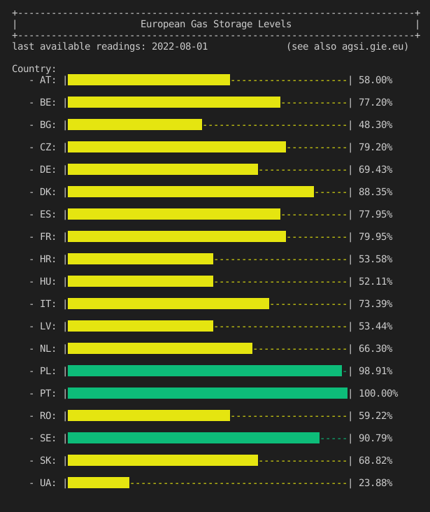

# European gas storage levels
A tool to get the current gas storage levels of the european countries.

Currently (August 2022) the gas levels in the european storage facilities are of huge interest. With this tool you can easily inspect them on your own.

# Before starting
The data is released by the "Gas Infrastructure Europe" (GIE). They offer an API service for the public free of charge which is used by this tool. To get access to the API you have to create an account [on their website](https://agsi.gie.eu/account). After sign up you get your personal API key.  

Clone this repository, navigate into it and create a file '.env' inside of which you specify you API key:  

        API_KEY=<your api key>

By the way, always make sure to not hard code an API key. Access a key using an environment variable. I.e. write it into a '.env' file and add '.env' to your .gitignore file so that it doesn't get published in your repository.

# Usage
Make sure you have read the above section "Before starting".  

Now navigate into the directory and type:  

        python3 gaslevels_eu.py

The output looks like this:  

  

# Note
With the data beeing released by the "Gas Infrastructure Europe" I don't guarantee for the correctness of the data. Check out [their website](https://agsi.gie.eu) for more information.